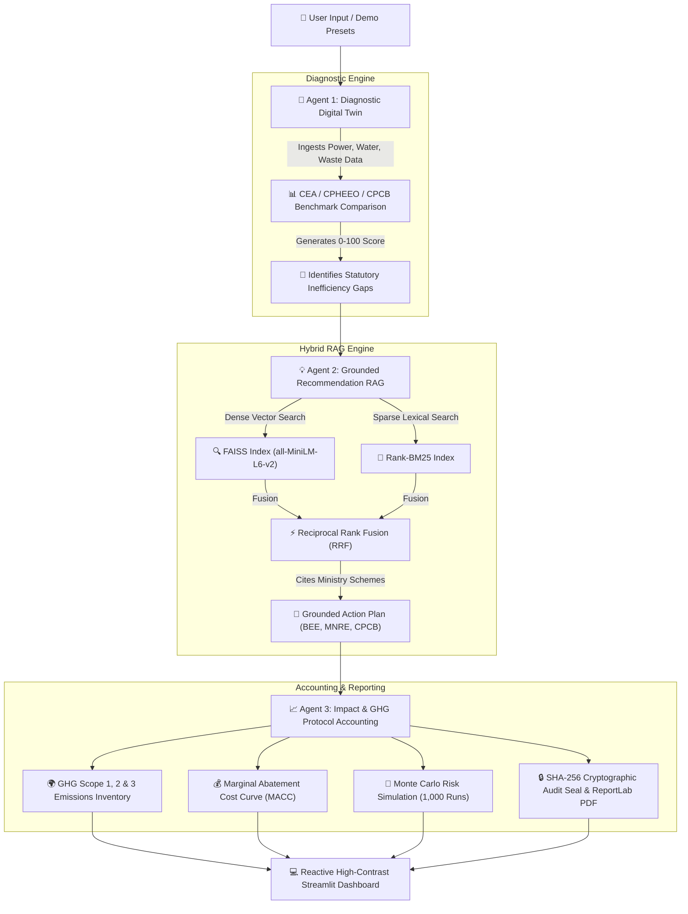

# 🌿 EcoAgent — Real-Time Agentic AI Sustainability & Carbon Advisor

[](https://www.python.org/)
[](https://streamlit.io/)
[]()
[]()
[](LICENSE)

> **Autonomous 3-Agent Carbon Intelligence System for Household & Enterprise Decarbonization**  
> **Submission Target:** 1M1B AI for Sustainability | AICTE | IBM SkillsBuild  
> **UN SDGs:** **SDG 12** *(Responsible Consumption)* & **SDG 13** *(Climate Action)* & **SDG 7** *(Clean Energy)*  
> **Compliance Standard:** **SEBI BRSR Core Principle 6** & **GHG Protocol (Scope 1, 2, 3)**  
> **Cost Model:** **100% Free & Open-Source Stack** — Zero paid API keys, zero paid hosting.

---

## 💡 Executive Summary & Problem Statement

Globally, buildings and residential/commercial spaces account for over **21% of greenhouse gas emissions** (IPCC AR6 WG3). In emerging economies like India, rapid urbanization has led to surging peak power loads, water stress, and mounting unsegregated municipal landfills.

While awareness is growing, individuals, small businesses, and enterprise ESG auditors face three critical roadblocks:
1. **Generic, Hallucinated AI Advice:** Traditional chatbots generate vague advice ("turn off lights", "use less water") without quantifiable financial ROI or legal basis.
2. **Disconnected Statutory Policy Schemes:** Citizens do not know that the Government of India provides up to **₹78,000 direct rooftop solar subsidies** (PM-Surya Ghar), enforces **24°C default AC regulations** (BEE), and mandates **3-stream waste segregation** (CPCB 2016).
3. **Lack of GHG Protocol & BRSR Alignment:** Most tools fail to categorize emissions according to global standards (Scope 1, Scope 2, Scope 3) or SEBI BRSR Essential Indicators required for enterprise disclosure.

**EcoAgent solves this through a grounded 3-Agent AI pipeline:**
- 🤖 **Agent 1 (Diagnosis):** Ingests facility data and benchmarks it against national statutory standards (CEA 95 kWh/capita, CPHEEO 135 LPCD, CPCB 0.45 kg/day).
- 💡 **Agent 2 (Recommendation RAG):** Uses **Hybrid Vector Search (FAISS + Rank-BM25 + RRF)** over indexed government gazettes (BEE, MNRE, CPCB, Swachh Bharat) to formulate grounded recommendations with **zero hallucination**.
- 📈 **Agent 3 (Impact & ROI):** Calculates verified cost savings (₹), categorizes emissions by **GHG Protocol Scope 1, 2, 3** using the **Central Electricity Authority (CEA) Baseline Factor (0.82 kg CO₂/kWh)**, tree equivalents, Monte Carlo risk confidence intervals, and compiles formal **PDF reports with SHA-256 cryptographic audit seals**.

---

## 🏗️ Autonomous 3-Agent Architecture



---

## 📊 Key Features & Master Navigation Tabs

| Tab | Feature | Description |
| :--- | :--- | :--- |
| **🏢 1. Diagnostics** | **Digital Twin Benchmarking** | Compares facility consumption against CEA (95 kWh/person), CPHEEO (135 LPCD), and CPCB (0.45 kg/day) with interactive appliance load pie charts. |
| **💡 2. Policy RAG** | **Grounded Policy Advisory** | Generates zero-hallucination recommendations traceable to official gazetted rules (BEE Room AC Star Rating, MNRE Solar Subsidy, CPCB Waste Rule 4) with interactive Knowledge Graph visualization. |
| **📈 3. Carbon & ROI** | **GHG Protocol Scopes 1-3 & ROI** | Computes Scope 1 (Direct Methane), Scope 2 (Grid Power @ 0.82 kg CO₂/kWh), and Scope 3 (Value Chain) savings alongside MACC curves, Monte Carlo 95% confidence intervals, SEBI BRSR Scorecard, and PDF export. |
| **🤖 4. AI Co-Pilot** | **Interactive EcoBot & RAG Search** | Conversational sustainability co-pilot powered by Gemini 3.6 Flash / Ollama with dense-sparse hybrid policy query explorer and SQLite audit persistent database log. |

---

## 🛡️ Alignment with UN SDGs & SEBI BRSR Core

| Framework | Metric / Indicator | EcoAgent Technical Implementation |
| :--- | :--- | :--- |
| **UN SDG 12: Responsible Consumption** | **Target 12.5:** Waste reduction & recycling | Mandates CPCB 2016 3-stream source segregation (Green/Blue/Red bins) and quantifies organic composting diverting 150-250 kg wet waste/yr. |
| **UN SDG 13: Climate Action** | **Target 13.3:** Climate mitigation | Quantifies carbon reduction using official CEA 0.82 kg CO₂/kWh grid factors and identifies high-impact 5-Star inverter AC & BLDC fan retrofits. |
| **UN SDG 7: Clean Energy** | **Target 7.2:** Renewable energy mix | Computes direct Central Financial Assistance (CFA) solar subsidies (up to ₹78,000 for 3 kW plants) under MNRE PM-Surya Ghar scheme. |
| **SEBI BRSR Core E1** | Energy Intensity | Evaluates total and per-capita electrical energy intensity against CEA baselines. |
| **SEBI BRSR Core E2** | Scope 1 & 2 Emissions | Scope 1: Direct methane prevention ($0.55 \text{ kg CO}_2\text{e/kg}$). Scope 2: CEA grid emission factor offset. |
| **SEBI BRSR Core E3 & E4** | Water Intensity & Waste Disposal | Faucet aerator savings & 3-bin solid waste processing compliance verification. |

---

## 💻 Tech Stack (100% Free & Open-Source)

- **UI Dashboard:** Streamlit with High-Contrast Eco-Chic Glassmorphism & Custom CSS
- **Hybrid RAG Engine:** FAISS (Facebook AI Similarity Search) + Rank-BM25 + Reciprocal Rank Fusion (RRF)
- **Embedding Model:** `sentence-transformers/all-MiniLM-L6-v2` (384-dimensional dense vectors)
- **LLM Synthesis:** Google Gemini 3.6 Flash API / Local Ollama (LLaMA-3) / Grounded RAG Engine
- **Data Analytics & Viz:** Plotly Express, Plotly Graph Objects, Pandas, NumPy
- **Stochastic Risk:** Monte Carlo Risk Engine (1,000 stochastic iterations)
- **Report Generation:** ReportLab PDF Engine with SHA-256 Tamper-Evident Verification Seal
- **Database:** SQLite Persistence (`ecoagent.db`)

---

## 🚀 Quick Setup & Installation

### Prerequisites
- Python 3.9+ (Tested on Python 3.10.11 & 3.11)
- Git

### 1. Clone & Navigate to Repository
```bash
git clone https://github.com/your-username/eco-agent.git
cd eco-agent
```

### 2. Install Dependencies
```bash
pip install -r requirements.txt
```

### 3. Build Hybrid RAG Vector Index
```bash
python build_index.py
```

### 4. Run Pipeline Integration Verification Test
```bash
python test_pipeline.py
```

### 5. Launch Dashboard
```bash
streamlit run app.py
```
*The reactive dashboard will automatically open at `http://localhost:8501`.*

---

## 📐 Key Math & Calculation Formulas

1. **Grid Electricity Carbon Offsets (Scope 2):**
   $$\Delta \text{CO}_2 \ (\text{kg/yr}) = \Delta \text{kWh}_{\text{annual}} \times 0.82 \ \text{kg CO}_2/\text{kWh}$$
   *(Source: Central Electricity Authority CO₂ Baseline Database Version 19.0)*

2. **Organic Methane Avoided (Scope 1):**
   $$\text{Methane Avoided (kg CO}_2\text{e/yr)} = \text{Composted Waste (kg/yr)} \times 0.55 \ \text{kg CO}_2\text{e/kg}$$
   *(Source: CPCB 2016 / Swachh Bharat Urban 2.0 Advisory)*

3. **Annual Financial Cost Savings:**
   $$\text{Annual Savings (₹)} = \Delta \text{kWh}_{\text{annual}} \times \text{Tariff (₹/kWh)}$$

4. **Tree Sequestration Equivalent:**
   $$\text{Trees Equivalent} = \frac{\Delta \text{CO}_2 \ (\text{kg/yr})}{21.77 \ \text{kg CO}_2/\text{tree/yr}}$$

---

## 👥 Authors & Acknowledgements

- **Project Name:** EcoAgent — Real-Time Agentic AI Sustainability Advisor
- **Submission Target:** 1M1B AI for Sustainability / AICTE / IBM SkillsBuild
- **Statutory Data Sources:** Bureau of Energy Efficiency (BEE), Ministry of New and Renewable Energy (MNRE), Central Pollution Control Board (CPCB), Central Electricity Authority (CEA), MoHUA Swachh Bharat Mission 2.0, IPCC AR6 WG3.
